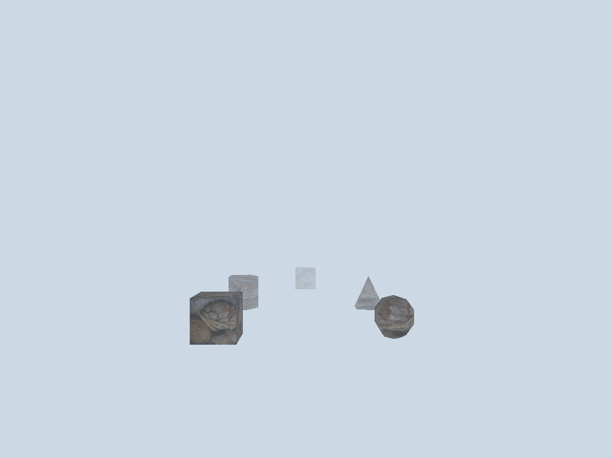
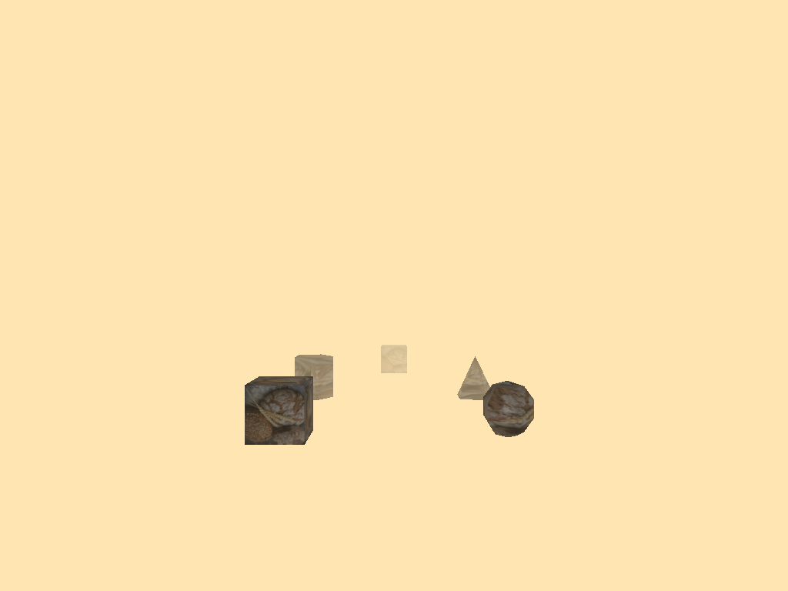
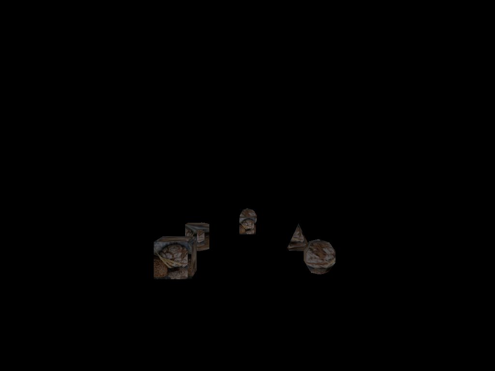
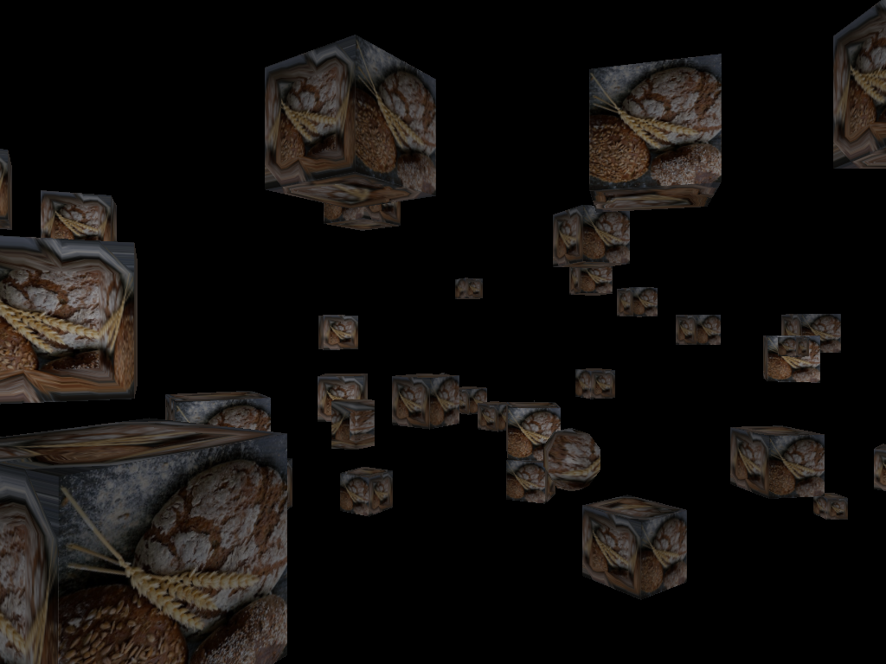

# Project 6 BREAD

## running tests


run unit tests:
```bash
cd build
ctest -V
cd ..
```

run all visual tests:
```bash
./run-tests.sh
```

All screenshots will be saved to student_outputs/final_project/

## Features implemented

### Feature 1: normal mapping (40 points)

Normal mapping adds surface detail to shapes without increasing geometry complexity. each vertex includes tangent and bitangent vectors in addition to position, normal, and uv coordinates. the fragment shader constructs a tbn (tangent-bitangent-normal) matrix to transform normal map samples from tangent space to world space.

Implementation details:
- vertex format extended from 8 floats to 14 floats per vertex
- tangent calculated along u direction, bitangent along v direction
- special handling for sphere poles where tangent degenerates
- texturemanager class handles texture loading and caching

### feature 2: realtime fog (20 points)

Distance-based fog blends distant objects with a fog color. the effect is calculated per-fragment using the distance from camera to fragment position. 


linear interpolation is used between fog start and fog end distances.

Implementation details:
- fog calculation: fogfactor = clamp((fogend - distance) / (fogend - fogstart), 0, 1)
- final color = mix(fogcolor, litcolor, fogfactor)
- background clear color matches fog color for seamless blending

### Feature 3: scrolling textures (20 points)

Ttexture coordinates are offset over time to create animated scrolling effects. the scroll direction and speed are configurable.

implementation details:
- uv offset calculated as: scrolldirection * scrollspeed * time
- works with any loaded diffuse texture
- scroll direction is a normalized 2d vector

### Feature 4: Instanced rendering (20 points)

Instanced rendering uses gldrawarraysinstanced to render many copies of the same geometry with a single draw call. each instance has its own transformation matrix stored in a vertex buffer.

Implementation details:
- instancemanager generates random transformation matrices
- per-instance mat4 passed via vertex attributes at locations 5-8
- vertex shader selects between modelmatrix and instancematrix based on uniform
- approximately 10x performance improvement over individual draw calls

## tests

### fog tests

#### test 1: fog disabled
baseline render with no fog applied. all objects visible at full color regardless of distance.

scene: scenefiles/test_fog.json
settings: enablefog = false


#### test 2: fog enabled
fog applied with default settings. objects fade to fog color based on distance from camera.

scene: scenefiles/test_fog.json
settings: enablefog = true, fogstart = 8.0, fogend = 20.0, fogcolor = (0.8, 0.85, 0.9)


#### test 3: fog near start
fog starts closer to camera. objects begin fading at z = -5 instead of z = -8.

scene: scenefiles/test_fog.json
settings: enablefog = true, fogstart = 5.0, fogend = 20.0



#### test 4: fog far start
fog starts further from camera. more objects visible before fog begins.

scene: scenefiles/test_fog.json
settings: enablefog = true, fogstart = 15.0, fogend = 25.0


#### test 5: fog warm color
fog color changed to warm tone. demonstrates color parameter control.

scene: scenefiles/test_fog.json
settings: enablefog = true, fogcolor = (1.0, 0.9, 0.7)



### normal mapping tests

#### test 6: normal mapping disabled
baseline render with flat shading. surface appears smooth without detail.

scene: scenefiles/test_normal_mapping.json
settings: enablenormalmapping = false


#### test 7: normal mapping enabled
normal map applied showing surface detail. bumps and surface variation visible.

scene: scenefiles/test_normal_mapping.json
settings: enablenormalmapping = true


### scrolling texture tests

#### test 8: scrolling disabled
baseline render with static textures. texture coordinates do not change over time.

scene: scenefiles/test_scrolling.json
settings: enablescrolling = false


#### test 9: scrolling enabled
texture scrolls horizontally at medium speed. visible animation when run interactively.

scene: scenefiles/test_scrolling.json
settings: enablescrolling = true, scrollspeed = 0.5, scrolldirection = (1.0, 0.0)



#### test 10: scrolling fast
Texture scrolls horizontally at high speed. demonstrates speed parameter control.

Scene: scenefiles/test_scrolling.json
settings: enablescrolling = true, scrollspeed = 2.0, scrolldirection = (1.0, 0.0)


#### test 11: scrolling vertical
texture scrolls vertically. demonstrates direction parameter control.

scene: scenefiles/test_scrolling.json
settings: enablescrolling = true, scrollspeed = 0.5, scrolldirection = (0.0, 1.0)


### instancing tests

#### test 12: instancing disabled
Baseline render showing only scene geometry. no instanced cubes.

scene: scenefiles/test_instancing.json
settings: enableinstancing = false


#### test 13: instancing enabled
100 cubes rendered with single draw call. random positions, rotations, and scales.

scene: scenefiles/test_instancing.json
settings: enableinstancing = true


#### test 14: random generation 1
first random generation showing stochastic behavior. same parameters produce different results.

scene: scenefiles/test_instancing.json
settings: enableinstancing = true


#### test 15: random generation 2
second random generation with different cube positions and orientations.

scene: scenefiles/test_instancing.json
settings: enableinstancing = true



#### test 16: random generation 3
third random generation demonstrating consistent randomness across runs.

scene: scenefiles/test_instancing.json
settings: enableinstancing = true


### combined test

#### test 17: all features combined
all visual effects enabled simultaneously. demonstrates feature independence and compatibility.

scene: scenefiles/test_all_features.json
settings: all features enabled


## unit tests

tangent and bitangent correctness verified for all shape types:
```bash
cd build
./test_tangent_bitangent
```

expected output:
```
testing cube tangent/bitangent orthogonality... passed
testing cube tangent/bitangent handedness... passed
testing sphere tangent/bitangent orthogonality... passed
testing sphere tangent/bitangent handedness... passed
testing cylinder tangent/bitangent orthogonality... passed
testing cylinder tangent/bitangent handedness... passed
testing cone tangent/bitangent orthogonality... passed
testing cone tangent/bitangent handedness... passed
all tests passed!
```

edge cases tested:
- sphere poles where uv coordinates converge
- cube corners and edges with uv discontinuities
- cylinder caps with circular uv mapping
- cone apex singularity

texture manager functionality:
```bash
cd build
./test_texture_manager
```

## command line usage

run specific test manually:
```bash
./build/BreadFinal scenefiles/test_fog.json --enable-fog --headless -o output.png
```

available options:
```
--enable-fog / --disable-fog
--fog-start <value>
--fog-end <value>
--fog-color <r,g,b>

--enable-normal-mapping / --disable-normal-mapping

--enable-scrolling / --disable-scrolling
--scroll-speed <value>
--scroll-direction <x,y>

--enable-instancing / --disable-instancing

--headless (auto-save and exit)
-o <file> (output path)
```

## design decisions

normal mapping: fixed sphere pole singularity by detecting degenerate tangent and recomputing from cross product of normal and bitangent. ensures orthogonality is maintained even at problematic uv coordinates.

fog: linear interpolation chosen over exponential fog for predictable behavior and simpler parameter tuning. background color set to match fog color for seamless blending at far plane.

scrolling: uv offset applied before texture sampling allows scrolling to work with any texture. direction vector normalized to ensure consistent speed regardless of direction.

instancing: random transformations include position, rotation around y-axis, and uniform scale. vertical spread reduced to 30% of horizontal spread for better visual distribution.

## files modified

core implementation:
- src/shapes/cube.cpp, sphere.cpp, cone.cpp, cylinder.cpp - extended vertex data to 14 floats
- src/shapes/shapemanager.cpp - updated vao setup for additional vertex attributes
- src/rendering/texturemanager.cpp - texture loading and caching
- src/rendering/instancemanager.cpp - instance transformation generation
- resources/shaders/default.vert - tbn vectors and instance matrix support
- resources/shaders/default.frag - fog, normal mapping, and scrolling implementation
- src/realtime.cpp - feature integration and rendering pipeline
- src/main.cpp - command line argument parsing

testing:
- tests/test_tangent_bitangent.cpp - tbn correctness verification
- tests/test_texture_manager.cpp - texture loading verification
- scenefiles/test_fog.json, test_normal_mapping.json, test_scrolling.json, test_instancing.json
- run-tests.sh - automated test execution

## known issues

none. all features working as intended.
